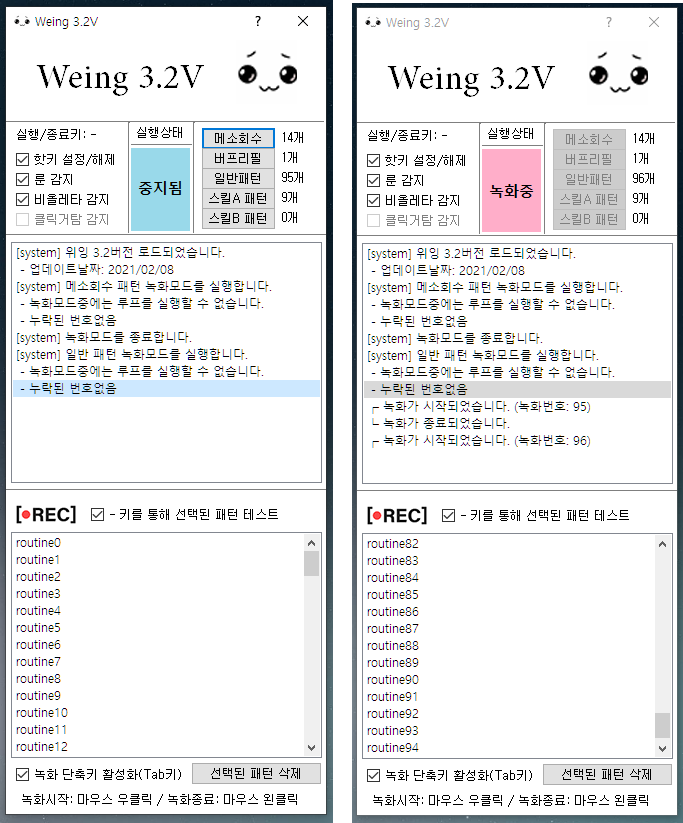

# Weing-3.0V
메이플스토리 매크로 자체 개발 (Key Record -Replay 방식) (GUI)

* 파이썬을 통해 개발
* GUI pyQT5 라이브러리 활용
* 파일시스템과 threading 활용
* 입출력관련 각종 라이브러리 활용
* ImageSearch를 통해 실시간 이미지 확인을 통한 동적인 매크로 실행

### Windows 기준 pyInstaller를 통해 빌드하여 exe파일 사용가능.
